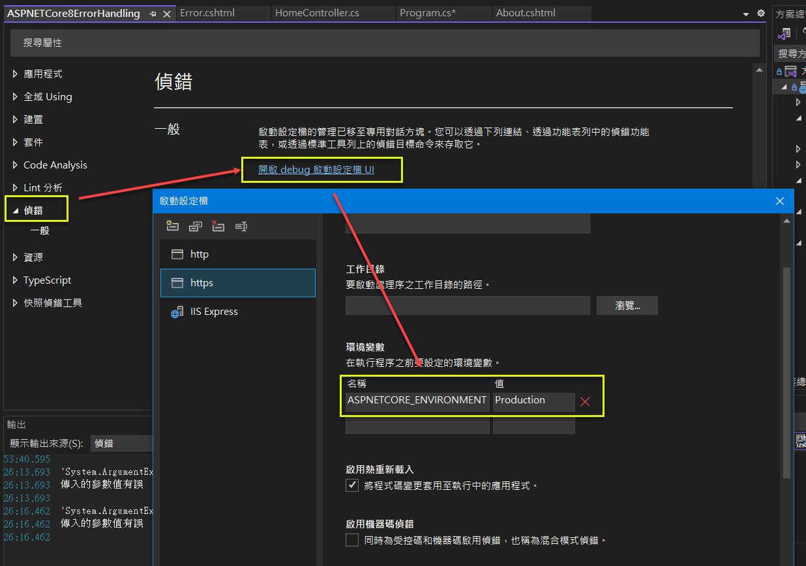

## ASP.NET MVC 及 ASP.NET Core MVC 的錯誤處理
## Error Handling in ASP.NET MVC and ASP.NET Core MVC  

## 前言

有效的錯誤處理, 對於確保應用程式的穩定性和用戶體驗, 是非常重要的; 若系統沒有作好錯誤處理, 而呈現程式錯誤細節給使用者, 代表系統不穩定, 且用戶體驗會非常糟糕.   

若您覺得這篇文章對您有幫助, 請不吝於在筆者的 <a href="https://github.com/jasper-lai/20240223_ASPNETCore8ErrorHandling" target="_blank">GitHub Repository</a> 上按星星, 謝謝.  

### (一) 名詞定義

1.. 錯誤(Error): 係指框架 (ASP.NET 或 ASP.NET Core), 或應用程式自定義的例外 (Exception). 本文會說明如何將未通過資料檢核的錯誤, 包裝為自定義用戶端例外拋出. 以提供一致性的錯誤訊息規格.  

2.. 錯誤處理(Error Handling): 係指錯誤取得 (Catch), 訊息規格 (Specification), 呈現 (Presentation), 及記錄 (Logging). 本文主要著重在錯誤取得及一致性錯誤訊息規格制訂.  

### (二) 錯誤取得機制概要

ASP.NET Core 提供了中介軟體 (Middleware) 的機制, 讓開發人員可以在整個 HTTP Request / Response 的過程中, 進行例外的攔截.  

MVC 框架本身 (含 ASP.NET MVC 及 ASP.NET Core MVC) 提供了例外過濾器 (Exception Filter) 的機制, 讓開發人員在 HTTP 訊息進入 MVC 的生命週後, 進行例外的攔截. 

理解 <a href="https://learn.microsoft.com/en-us/aspnet/core/mvc/controllers/filters?view=aspnetcore-8.0" target="_blank">(Microsoft Learn) Filters in ASP.NET Core</a>  的 2 張圖, 對開發人員而言, 是非常重要的. 

若要完全處理整個 Web 應用程式的例外, 實作方面的相關配套如下:  

1.. ASP.NET MVC: 要搭配 Web.config 或 Global.asax + 自定義的 ErrorController.  

2.. ASP.NET Core MVC: 可以自行撰寫 ASP.NET Core 的例外處理中介軟體 (Middleware).  
**說明: Middleware 是屬於 ASP.NET Core, 不是 ASP.NET Core MVC; ASP.NET Core MVC 是建置在 ASP.NET Core 上的一個框架.**  

3.. ASP.NET Core 8 以後提供了實作 IExceptionHandler 介面的方式, 簡化例外處理 Middleware 的撰寫, 內建的 app.UseExceptionHandler(), 其實也是一佪 Middleware, 會使用前述的類別, 攔截例外. 只是筆者能力有限, 目前遇到無法取得 routeData (ex: controller, action 名稱) 的問題, 雖然本文還是有提供範例, 但暫不推薦此方式.  

### (三) 一致性的錯誤訊息規格概要

回傳一致性的錯誤訊息, 對於系統的開發及對用戶體驗, 是非常有幫助的. 

1.. ASP.NET MVC: 只能自定義錯誤訊息類別.  

2.. ASP.NET Core MVC: 可採用自定義錯誤訊息類別, 或內建的 <a href="https://learn.microsoft.com/en-us/dotnet/api/microsoft.aspnetcore.mvc.problemdetails?view=aspnetcore-8.0" target="_blank">ProblemDetails</a> 類別.   
**說明: ASP.NET Core 2.1 起, 有一個依 <a href="https://datatracker.ietf.org/doc/html/rfc7807" target="_blank">IETF >RFC7807 規範</a> 設計的 ProblemDetails 類別, 用以統一回傳結果. 但也可視需求, 自行定義統一的回傳類別.**  
**說明: 本文採自定義的 ErrorViewModel 類別作為回傳格式, 作為說明之用. 但最後仍補上採用 ProblemDetails 類別的範例.**  

伺服端程式必須進行資料檢核, 才能去存取資料庫. 若資料檢核發現有誤, 代表用戶端沒有作好資料檢核的工作, 或者被瀏覽器的 F12 破解, 因此屬於用戶端的問題 (HTTP 4XX).  

這類的錯誤, 需設計繼承自 Exception 類別的自定義例外類別, 當發生未通過檢核時, 打包為自訂例外拋出,  由前述的 Middleware 或 Exception Filter 攔截及處理.  

上述的文字內容的思路, 可參考結論的流程圖.    

### (四) 章節內容

本文將探討 ASP.NET MVC 及 ASP.NET Core MVC 中一些錯誤處理實作技巧.  

一. [預設的錯誤處理方式](#section1)  
二. [自定義統一的回傳的錯誤訊息規格](#section2)  
三. [自定義 Middleware, 用以產生貫穿 Request 軌跡的 TraceId](#section3)  
四. [撰寫 自定義例外 (Custom Exception), 供後續 Middleware 或 Filter 使用 ](#section4)  
五. [自定義 Middleware 攔截例外 (ASP.NET Core)](#section5)  
六. [建立 Exception Filter (ASP.NET MVC or ASP.NET Core MVC)](#section6)  
七. [實作 IExceptionHandler (ASP.NET Core 8 and later)](#section7)  
八. [建立另一個 MVC 專案, 參考前述的例外處理專案](#section8)  

目前 GitHub 上的範例版本為最後一版, <a href="https://github.com/jasper-lai/20240223_ASPNETCore8ErrorHandling" target="_blank">請下載參考</a>. 輸出結果, 若發現回傳值有 JSON 欄位名稱字首大小寫的差異 (例如: TraceId vs. traceId), 或者有增加欄位 (例如: ControllerName, ActionName), 請再自行參酌程式碼.  前者是因為在輸出 JSON 時, 有對 System.Text.Json 作了一些選項的設定; 後者是因為要寫 Log 時, 需要該欄位.    
<!--more-->

## 一. 預設的錯誤處理方式 <a id="section1"></a>

以下是在只有加上拋出例外程式段的預設狀況.  

1.. 加上製造例外的程式段.  
只要瀏覽到 ~/Home/About/1 就會發生例外.  
```csharp
public IActionResult About(int id = 0)
{
    if (id == 1)
    {
        _logger.LogError("傳入的參數值有誤");
        throw new ArgumentException("傳入的參數值有誤");
    }
    return View();
}
```

2.. 預設會有 Middleware 攔截例外, 依是否為 Development 環境有不同的處理方式.  

**以下 else 的部份, 是筆者自行加上去的, 預設是沒有的, 但有加上會比較清楚.**  

若不在 Development 環境下, app.UseExceptionHandler("/Home/Error"), 會將錯誤導向 /Home/Error 的頁面. 
若是在 Development 環境下, app.UseDeveloperExceptionPage() 錯誤頁面會呈現.  
請留意: Error.cshtml 不在 Views/Home, 而是在 Views/Shared 之下.  

```csharp
if (!app.Environment.IsDevelopment())
{
    app.UseExceptionHandler("/Home/Error");
    app.UseHsts();
}
else
{
    app.UseDeveloperExceptionPage();
}
```  

(1) Production 環境下的截圖.  
  

(2) Development 環境下的截圖.  
  

3.. 在 VS 2022 之下, 預設是 Development, 要如何調整成 Production 呢? 請參考下圖.  
  

4.. 在 瀏覽器 可以看到, 是回應 500 Internal Server Error.  
按理, 這是客戶端的錯誤, 不應該回傳 HTTP 500, 事實上, 可以把一些檢核錯誤, 轉換為自定義的 Exception 類別, 集中處理.  
  


## 二. 自定義統一的回傳的錯誤訊息規格 <a id="section2"></a>

包含以下欄位, 其中 TraceId 為每次 Http Request 的唯一識別碼, 用以記錄至 Log.  

```csharp
public class ErrorViewModel
{
	/// <summary>
	/// Http Request 唯一識別碼
	/// </summary>
	public string? TraceId { get; set; }

	/// <summary>
	/// HTTP 狀態碼
	/// </summary>
	public int StatusCode { get; set; } = (int)(HttpStatusCode.OK);

	/// <summary>
	/// HTTP 狀態碼列舉名稱
	/// </summary>
	public string StatusCodeName { get; set; } = HttpStatusCode.OK.ToString();

	/// <summary>
	/// 訊息說明
	/// </summary>
	public string Message { get; set; } = string.Empty;

	public ErrorViewModel() { }
}
```

## 三. 自定義 Middleware, 用以產生貫穿 Request 軌跡的 TraceId <a name="section3"></a>

1.. 類別本身

```csharp
public class TraceIdMiddleware
{
    private readonly RequestDelegate _next;

    public TraceIdMiddleware(RequestDelegate next)
    {
        _next = next;
    }

    public async Task InvokeAsync(HttpContext context)
    {
        context.TraceIdentifier = Guid.NewGuid().ToString();
        string traceId = context.TraceIdentifier;
        context.Response.Headers["X-Trace-Id"] = traceId;
        await _next(context);
    }
}
```

2.. 註冊 (in Program.cs)

```csharp
#region TraceIdMiddleware
// 註冊自定義 HttpContext.TraceIdentifier 的 Middleware
app.UseMiddleware<TraceIdMiddleware>();
#endregion
```

## 四. 撰寫 自定義例外 (Custom Exception), 供後續 Middleware 或 Filter 使用 <a name="section4"></a>

撰寫 自定義例外 (Custom Exception), 將一些常見的用戶端錯誤, 通常是將未通過檢核的狀況, 轉換為自定義例外類別, 供程式拋出, 由 Middleware 或 Filter 攔截, 進行集中的處埋.  

Custom Exception 類別繼承架構, 如下截圖及程式碼:  

  


```csharp
/// <summary>
/// 抽象的自定義例外基底類別
/// </summary>
public abstract class MyExceptionBase : Exception
{
    protected MyExceptionBase()
    {
    }

    protected MyExceptionBase(string? message) : base(message)
    {
    }

    protected MyExceptionBase(string? message, Exception? innerException)
        : base(message, innerException)
    {
    }

}
```

```csharp
#region 此區例外, 將會回傳 HTTP 4XX

/// <summary>
/// 用戶端資料未通過檢核: 發生空值
/// </summary>
/// <remarks>會回傳 HTTP 400 Bad Request</remarks>
public class MyParamNullException : MyExceptionBase
{
    public override string Message { get; }

    public MyParamNullException(string fieldDescription)
    {
        this.Message = $"{fieldDescription} 不能為空!";
    }
}

/// <summary>
/// 用戶端資料未通過檢核: 超出範圍. 
/// </summary>
/// <remarks>會回傳 HTTP 400 Bad Request</remarks>
public class MyOutRangeException : MyExceptionBase
{
    public override string Message { get; }

    public MyOutRangeException(string fieldDescription)
    {
        this.Message = $"{fieldDescription} 超出範圍!";
    }
}

/// <summary>
/// 用戶端資料未通過檢核: 資料不存在. 通常用在 查詢/更新/刪除
/// </summary>
/// <remarks>會回傳 HTTP 404 Not Found</remarks>
public class MyDataNotExistException : MyExceptionBase
{
    public override string Message { get; }

    public MyDataNotExistException(string fieldDescription)
    {
        this.Message = $"{fieldDescription} 資料不存在!";
    }
}

/// <summary>
/// 用戶端資料未通過檢核: 資料已存在. 通常用在 新增
/// </summary>
/// <remarks>會回傳 HTTP 409 Conflict</remarks>
public class MyDataExistException : MyExceptionBase
{
    public override string Message { get; }

    public MyDataExistException(string fieldDescription)
    {
        this.Message = $"{fieldDescription} 資料已存在!";
    }
}

/// <summary>
/// 用戶端資料未通過檢核: 未通過認證及授權
/// </summary>
/// <remarks>會回傳 HTTP 401 Unauthorized</remarks>
public class MyUnauthorizedException : MyExceptionBase
{
    public override string Message { get; }

    public MyUnauthorizedException()
    {
        this.Message = $"您未通過認證及授權!";
    }
}

/// <summary>
/// 用戶端資料未通過檢核: 無存取此頁面功能的權限
/// </summary>
/// <remarks>會回傳 HTTP 403 Forbidden</remarks>
public class MyForbiddenException : MyExceptionBase
{
    public override string Message { get; }

    public MyForbiddenException()
    {
        this.Message = $"您無存取此頁面功能的權限!";
    }
}

/// <summary>
/// 用戶端資料未通過檢核: 其它狀況
/// </summary>
/// <seealso cref="ASPNETCore8ErrorHandling.Filters.MyExceptionBase" />
/// <remarks>會回傳 HTTP 400 Bad Request</remarks>
public class MyClientException : MyExceptionBase
{
    public override string Message { get; }

    public MyClientException(string description)
    {
        this.Message = $"{description}";
    }
}

#endregion

```

## 五. 自定義 Middleware 攔截例外 (ASP.NET Core) <a name="section5"></a>

本章節所撰寫的程式碼, 與 GitHub 的最後版本有不同, 但仍可自行實作測試.  

### (一) 實作

1.. 修改 HomeController.cs 的 About() method, 改為抛出 MyClientException 

```csharp
public IActionResult About(int id = 0)
{
    if (id == 1)
    {
        _logger.LogError("傳入的參數值有誤");
        throw new MyClientException("傳入的參數值有誤");
    }
    return View();
}
```

2.. 撰寫自定義的例外處理 Middleware  
```csharp
public class ExceptionHandlingMiddleware
{
	private readonly RequestDelegate _next;
	private readonly ILogger<ExceptionHandlingMiddleware> _logger;

	public ExceptionHandlingMiddleware(RequestDelegate next, ILogger<ExceptionHandlingMiddleware> logger)
	{
		_next = next;
		_logger = logger;
	}

	public async Task InvokeAsync(HttpContext context)
	{
		try
		{
			await _next(context);
		}
		catch (Exception ex)
		{
			await HandleExceptionAsync(context, ex);
		}
	}

	private async Task HandleExceptionAsync(HttpContext context, Exception exception)
	{
        // 取得 REQUEST 的唯一識別碼
        var traceId = context.TraceIdentifier;
        _logger.LogError(exception, "traceId={traceId} --> An unexpected error occurred.", traceId);

        ErrorViewModel response = exception switch
        {
            ApplicationException _ => new ErrorViewModel()
            { TraceId = traceId, StatusCode = (int)HttpStatusCode.BadRequest, StatusCodeName = HttpStatusCode.BadRequest.ToString(), Message = "用戶端傳送資料有誤" },
            UnauthorizedAccessException _ => new()
            { TraceId = traceId, StatusCode = (int)HttpStatusCode.Unauthorized, StatusCodeName = HttpStatusCode.Unauthorized.ToString(), Message = "未通過認證授權" },
            _ => new()
            { TraceId = traceId, StatusCode = (int)HttpStatusCode.InternalServerError, StatusCodeName = HttpStatusCode.InternalServerError.ToString(), Message = "伺服器發生未預期的錯誤" },
        };
        context.Response.ContentType = "application/json";
        context.Response.StatusCode = (int)response.StatusCode;
        await context.Response.WriteAsJsonAsync(response);
	}
}
```

3.. 註冊定義的例外處理 Middleware  
```csharp
// Configure the HTTP request pipeline.
if (!app.Environment.IsDevelopment())
{
    app.UseExceptionHandler("/Home/Error");
    // The default HSTS value is 30 days. You may want to change this for production scenarios, see https://aka.ms/aspnetcore-hsts.
    app.UseHsts();
}
else
{
    app.UseDeveloperExceptionPage();
}

// 註冊自定義產出 TraceId 的 Middleware
app.UseMiddleware<TraceIdMiddleware>();

// 註冊例外攔截的 Middleware
// 注意: 這個必須排在預設內建的例外處理機制之後, 在發生例外時, 才能由自定義的 Middleware 作處理
app.UseMiddleware<ExceptionHandlingMiddleware>();
```

### (二) 實測

~/Home/About/1 會抛出 MyClientException, 但在前述的 ExceptionHandlingMiddleware 沒有特別攔截該項目, 而轉成 Http 500: InternalServerError.  

1.. Request:  
https://localhost:7244/Home/About/1  

2.. Response:  

```json
{
    traceId: "ec45159d-1ab9-4596-842e-faede72327c7",
    statusCode: 500,
    statusCodeName: "InternalServerError",
    message: "伺服器發生未預期的錯誤"
}
```

## 六. 建立 Exception Filter (ASP.NET MVC or ASP.NET Core MVC) <a name="section6"></a>

Exception Filter 在 ASP.NET 時代的 MVC 就有了, 是內建於 MVC 的一個錯誤處理機制.  

參考文件11.. 及 參考文件12.. 有建議採用 IExceptionHandler (ASP.NET Core 8 and later) 或自定義的 Middlewae (ASP.NET Core) 作全域錯誤的攔截, 而不要採用 MVC 本身的 Exception Filter.   
  
但因為在 ASP.NET Core 以前, 大部份都是用這個方式作 MVC 錯誤攔截, 故還是提一下實作方式.  

### (一) 實作

1.. 建立 Exception Filter  

```csharp
public class MyExceptionFilter : IExceptionFilter
{
	private readonly ILogger<MyExceptionFilter> _logger;

	public MyExceptionFilter(ILogger<MyExceptionFilter> logger)
	{
		_logger = logger;
	}

	public void OnException(ExceptionContext context)
	{
		// STEP 1: 建立回傳物件
		var exception = context.Exception;
		var traceId = context.HttpContext.TraceIdentifier;   // 這個已經被 middleware 改成 GUID

		ErrorViewModel result = exception switch
		{
			MyParamNullException _  or
			MyOutRangeException  _  or
			MyClientException    _ => new ErrorViewModel()
			{ TraceId = traceId, StatusCode = (int)HttpStatusCode.BadRequest, StatusCodeName = HttpStatusCode.BadRequest.ToString(), Message = exception.Message },

			MyDataNotExistException _ => new ErrorViewModel()
			{ TraceId = traceId, StatusCode = (int)HttpStatusCode.NotFound, StatusCodeName = HttpStatusCode.NotFound.ToString(), Message = exception.Message },

			MyDataExistException _ => new ErrorViewModel()
			{ TraceId = traceId, StatusCode = (int)HttpStatusCode.Conflict, StatusCodeName = HttpStatusCode.Conflict.ToString(), Message = exception.Message },

			MyUnauthorizedException _ => new ErrorViewModel()
			{ TraceId = traceId, StatusCode = (int)HttpStatusCode.Unauthorized, StatusCodeName = HttpStatusCode.Unauthorized.ToString(), Message = exception.Message },

			MyForbiddenException _ => new ErrorViewModel()
			{ TraceId = traceId, StatusCode = (int)HttpStatusCode.Forbidden, StatusCodeName = HttpStatusCode.Forbidden.ToString(), Message = exception.Message },

			_ => new()
			{ TraceId = traceId, StatusCode = (int)HttpStatusCode.InternalServerError, StatusCodeName = HttpStatusCode.InternalServerError.ToString(), Message = "伺服器發生未預期的錯誤" },
		};

		// STEP 2: 設定已處理例外, 不再往外拋出
		context.ExceptionHandled = true;

		// STEP 3: 回傳結果 (JSON 格式)
		context.Result = new JsonResult(result)
		{
			StatusCode = result.StatusCode // Optionally set the status code of the HTTP response
		};

		// STEP 4: 寫入至 Log
		if (result.StatusCode >= 400 &&  result.StatusCode < 500 )
			_logger.LogWarning(exception.Message);
		if (result.StatusCode >= 500)
			_logger.LogError(exception.Message);
	}
}
```

2.. 註冊 Exception Filter.   

```csharp
var builder = WebApplication.CreateBuilder(args);

// {jasper} 註冊全域的 Exception Filter
builder.Services.AddScoped<MyExceptionFilter>();
builder.Services.AddControllersWithViews(options =>
{
    options.Filters.AddService<MyExceptionFilter>();
});

var app = builder.Build();
```

### (二) 實測

~/Home/About/1 會抛出 MyClientException, 會被 MyExceptionFilter 攔截到,  而轉成 Http 400: BadRequest   
```json
{
    traceId: "0a3a3c93-7dab-4e80-9cfc-45c4b5300f5e",
    statusCode: 400,
    statusCodeName: "BadRequest",
    message: "傳入的參數值有誤"
}
```

## 七. 實作 IExceptionHandler (ASP.NET Core 8 and later) <a name="section7"></a>

**如同在前言所述的, 這個功能看來還是有一些問題, 筆者不推薦使用; 而是建議採 自定義 Middleware + ProblemDetails 類別. GitHub 上的程式版本, 即採用此方式.**   

<a href="https://learn.microsoft.com/en-us/dotnet/api/microsoft.aspnetcore.diagnostics.iexceptionhandler?view=aspnetcore-8.0" target="_blank">IExceptionHandler</a> 是 ASP.NET Core 8 新增加的介面. 該介面的實作類別, 會被內建的 app.UseExceptionHandler() 叫用.  

需留意 ASP.NET Core 有提供一個 StatusCodes class, 與 HttpStatusCode enum 有所不同, 細節參考 [補充] 章節.  

### (一) 撰寫回傳 ErrorViewModel 的 GlobalExceptionHandler 類別.

```csharp 
public class GlobalExceptionHandler : IExceptionHandler
{
	private readonly ILogger<GlobalExceptionHandler> _logger;

	public GlobalExceptionHandler(ILogger<GlobalExceptionHandler> logger)
	{
		_logger = logger;
	}

	#region 方式一: 回傳自定義的錯誤類別

	public async ValueTask<bool> TryHandleAsync(
	   HttpContext context,
	   Exception exception,
	   CancellationToken cancellationToken)
	{
	   // STEP 1: 建立回傳物件
	   var traceId = context.TraceIdentifier;   // 這個已經被 middleware 改成 GUID

	   ErrorViewModel result = exception switch
	   {
	       MyParamNullException _ or
	       MyOutRangeException _ or
	       MyClientException _ => new ErrorViewModel()
	       { TraceId = traceId, StatusCode = (int)HttpStatusCode.BadRequest, StatusCodeName = HttpStatusCode.BadRequest.ToString(), Message = exception.Message },

	       MyDataNotExistException _ => new ErrorViewModel()
	       { TraceId = traceId, StatusCode = (int)HttpStatusCode.NotFound, StatusCodeName = HttpStatusCode.NotFound.ToString(), Message = exception.Message },

	       MyDataExistException _ => new ErrorViewModel()
	       { TraceId = traceId, StatusCode = (int)HttpStatusCode.Conflict, StatusCodeName = HttpStatusCode.Conflict.ToString(), Message = exception.Message },

	       MyUnauthorizedException _ => new ErrorViewModel()
	       { TraceId = traceId, StatusCode = (int)HttpStatusCode.Unauthorized, StatusCodeName = HttpStatusCode.Unauthorized.ToString(), Message = exception.Message },

	       MyForbiddenException _ => new ErrorViewModel()
	       { TraceId = traceId, StatusCode = (int)HttpStatusCode.Forbidden, StatusCodeName = HttpStatusCode.Forbidden.ToString(), Message = exception.Message },

	       _ => new()
	       { TraceId = traceId, StatusCode = (int)HttpStatusCode.InternalServerError, StatusCodeName = HttpStatusCode.InternalServerError.ToString(), Message = "伺服器發生未預期的錯誤" },
	   };

	   // STEP 2: 設定回傳的 response header
	   context.Response.StatusCode = result.StatusCode;

	   // STEP 3: 寫入至 Log
	   if (result.StatusCode >= 400 && result.StatusCode < 500)
	       _logger.LogWarning(exception.Message);
	   if (result.StatusCode >= 500)
	       _logger.LogError(exception, exception.Message);

	   // STEP 4: 回傳結果
	   await context.Response
	       .WriteAsJsonAsync(result, cancellationToken);

	   // STEP 5: 設定已處理例外, 不再往外拋出
	   return true;
	}

	#endregion
}
```

### (二) 撰寫回傳 ProblemDetails 的 GlobalExceptionHandler 類別. (optional)

```csharp

public class GlobalExceptionHandler : IExceptionHandler
{
	private readonly ILogger<GlobalExceptionHandler> _logger;

	public GlobalExceptionHandler(ILogger<GlobalExceptionHandler> logger)
	{
		_logger = logger;
	}

	#region 方式二: 回傳 ASP.NET Core 內建的 ProblemDetails 類別

	public async ValueTask<bool> TryHandleAsync(
		HttpContext context,
		Exception exception,
		CancellationToken cancellationToken)
	{

		// STEP 1: 建立回傳物件
		var traceId = context.TraceIdentifier;

		ProblemDetails problemDetails = exception switch
		{
			MyParamNullException _ or
			MyOutRangeException _ or
			MyClientException _ => new ProblemDetails()
			{
				Title = HttpStatusCode.BadRequest.ToString(),
				Status = StatusCodes.Status400BadRequest,
			},

			MyDataNotExistException _ => new ProblemDetails()
			{
				Title = HttpStatusCode.NotFound.ToString(),
				Status = StatusCodes.Status404NotFound,
			},

			MyDataExistException _ => new ProblemDetails()
			{
				Title = HttpStatusCode.Conflict.ToString(),
				Status = StatusCodes.Status409Conflict,
			},

			MyUnauthorizedException _ => new ProblemDetails()
			{
				Title = HttpStatusCode.Unauthorized.ToString(),
				Status = StatusCodes.Status401Unauthorized,
			},

			MyForbiddenException _ => new ProblemDetails()
			{
				Title = HttpStatusCode.Forbidden.ToString(),
				Status = StatusCodes.Status403Forbidden,
			},

			_ => new()
			{
				Title = HttpStatusCode.InternalServerError.ToString(),
				Status = StatusCodes.Status500InternalServerError,
			}
		};

		if (problemDetails.Status != StatusCodes.Status500InternalServerError)
			problemDetails.Detail = exception.Message;
		else
			problemDetails.Detail = "伺服器發生未預期的錯誤";

		problemDetails.Instance = context.Request.Path;
		problemDetails.Extensions.Add("traceId", traceId);

		// STEP 2: 設定回傳的 response header
		context.Response.StatusCode = problemDetails.Status ?? StatusCodes.Status500InternalServerError;

		// STEP 3: 寫入至 Log
		if (problemDetails.Status >= 400 && problemDetails.Status < 500)
			_logger.LogWarning("{ExceptionMessage}", exception.Message);
		if (problemDetails.Status >= 500)
			_logger.LogError(exception, "{ExceptionMessage}", exception.Message);

		// STEP 4: 回傳結果
		await context.Response
			.WriteAsJsonAsync(problemDetails, cancellationToken);

	   // STEP 5: 設定已處理例外, 不再向外拋出
		return true;
	}

	#endregion
}

```

### (三) 設置

修訂 Program.cs 的內容.  

```csharp
#region 註冊 GlobalExceptionHandler 及 ProblemDeatils 至 DI
builder.Services.AddExceptionHandler<GlobalExceptionHandler>();
builder.Services.AddProblemDetails();
#endregion
```

```csharp
#region 使用內建的 ExceptionHandler
app.UseExceptionHandler();
#endregion
```

### (四) 實測

1.. 自定義的 ErrorViewModel 類別.   
```json
{
  traceId: "d1d2538c-e27b-4ff7-b1a0-fcf653363377",
  statusCode: 400,
  statusCodeName: "BadRequest",
  message: "傳入的參數值有誤"
}
```

2.. ASP.NET Core 內建的 ProblemDetails 類別.  
```json
{
  title: "BadRequest",
  status: 400,
  detail: "傳入的參數值有誤",
  instance: "/Home/About/1",
  traceId: "4bbf5f78-cacd-4033-80bf-b3fd37a03bcb"
}
```

## 八. 建立另一個 MVC 專案, 參考前述的例外處理專案 <a name="section8"></a>

### (一) 實作

1.. 加入一個 MVC 專案: MyBakeryMvcWeb  

2.. 加入 ProductController / ProductService 及 相關的 View (.cshtml)   

3.. 加入專案參考: ASPNETCore8ErrorHandling  

4.. 執行 MyBakeryMvcWeb 看看, 會發生以下例外.  
```ini
AmbiguousMatchException: The request matched multiple endpoints. Matches:   MyBakeryMvcWeb.Controllers.HomeController.Index (MyBakeryMvcWeb)   ASPNETCore8ErrorHandling.Controllers.HomeController.Index (ASPNETCore8ErrorHandling)
```
解決方式: 在 ASPNETCore8ErrorHandling HomeController 加上 route attribute; 如果要單獨執行 ASPNETCore8ErrorHandling 的話, 要把那個 route attribute 註解掉.    
```csharp
[Route("ASPNETCore8ErrorHandling/[controller]/[action]")]
```  

5.. 輸入資料檢核的部份:  
**(1) 在 Action 將 ModelErrors 轉成字串, 包在 MyClientException 的 description 參數, 以統一處理.**  
```csharp
[HttpPost]
public IActionResult CreateAjaxJson([FromBody] ProductViewModel product)
{
    // 處理 validation attribute (model binding) 檢核未過的錯誤
    if (!ModelState.IsValid)
    {
        var description = this.ModelErrorToString();
        throw new MyClientException(description); 
    }
    var result = _service.Create(product);
    _logger.LogInformation("處理結果: {result}", result);
    return View("Create",product);
}
```  

(2) 輸出的JSON內容.  
```json
{
    "Title": "BadRequest",
    "Status": 400,
    "Detail": "輸入的資料有誤: \r\n產品名稱必須在 2 ~ 10 個字元之間\r\n訂購數量 的資料值, 必須介於 1 ~ 10.",
    "Instance": "/Product/CreateAjaxJson",
    "TraceId": "06a4755f-bbe5-4fc8-a8e3-e1206029fe26",
    "ControllerName": "Product",
    "ActionName": "CreateAjaxJson"
}
```  

6.. 修改 Create.cshtml: 完成所需的例外功能測試項目 button.  

### (二) 實測
以下僅列出一些實測截圖. 有興趣可以自行實測看看.  

1.. Model Validation Error 截圖
   

2.. 自定義 Exception 截圖  
  

3.. Internal Server Error 截圖  
  

## 結論

本篇整個思路架構如下圖, 黃底為筆者建議的實作方式, 供參考.  
  

ASP.NET Core 的 Middleware 可以取代原本 MVC 的 Exception Filter 的功能, 涵蓋的範圍也更大. 亦即, 在 ASP.NET Core 的環境下, 只要實作 Middleware, 而不需實作 Exception Filter. 所以, 上圖在 ASP.NET Core 的環境下, Exception Filter 沒有被標記為黃底.   

如筆者在前言所述, 如有發生例外時, 一般都會有記錄 controller 及 action 的需求, 因為筆者實測 ASP.NET Core 8 IExceptionHandler 的方式時, 會取不到 HttpContext 的路由資料 (RouteData), 故建議採用 自定義的例外處理 Middleware 的方式.  

筆者有在 <a href="https://stackoverflow.com/questions/78039198/cannot-get-routedata-in-iexceptionhandler-tryhandleasync-for-asp-net-core-8" target="_blank">Stackflow</a> 提問, 但不確定是否能得到解答, 有興趣的朋友, 可以關注一下那則討論.  

## 參考文件

* <a href="https://learn.microsoft.com/en-us/aspnet/core/mvc/controllers/filters?view=aspnetcore-8.0" target="_blank">1.. (Microsoft Learn) Filters in ASP.NET Core</a>  
> 這篇描述 ASP.NET Core Filters 的流程. 有 2 張重要的圖, 節錄如下:

  
  

* <a href="https://learn.microsoft.com/en-us/aspnet/core/fundamentals/error-handling?view=aspnetcore-8.0" target="_blank">2.. (Microsoft Learn) Handle errors in ASP.NET Core</a>  
> ASP.NET Core 的錯誤處理: 主要針對 ASP.NET Core MVC

* <a href="https://learn.microsoft.com/en-us/aspnet/core/web-api/handle-errors?view=aspnetcore-8.0" target="_blank">3.. (Microsoft Learn) Handle errors in ASP.NET Core web APIs</a>  
> ASP.NET Core Web APIs 的錯誤處理

* <a href="https://dev.to/andytechdev/aspnet-core-middleware-working-with-global-exception-handling-3hi0" target="_blank">4.. (Andy) ASP.NET Core Middleware: Working with Global Exception Handling</a>  

* <a href="https://stackoverflow.com/questions/67016969/traceid-requestid-and-traceidentifier-in-asp-net-core" target="_blank">5.. (StackOverflow) TraceId, RequestId, and TraceIdentifier in ASP.NET Core</a>  
> 有提到一個例子, 若 traceparent: 00-0af7651916cd43dd8448eb211c80319c-b7ad6b7169203331-01, 則
```ini
Activity.TraceId:            0af7651916cd43dd8448eb211c80319c
Activity.SpanId:             04dcdddd4175b2a4
Activity.TraceFlags:         Recorded
Activity.ParentSpanId:       b7ad6b7169203331
Activity.ActivitySourceName: Microsoft.AspNetCore
```

* <a href="https://www.w3.org/TR/trace-context-1/#header-name" target="_blank">6.. (W3C) (202111) Trace Context</a>  

* <a href="https://github.com/dotnet/aspnetcore/issues/39873" target="_blank">7.. [Question] HttpContext.TraceIdentifier vs Activity.Current.Id #39873</a>  
> 這篇有詢問 HttpContext.TraceIdentifier vs Activity.Current.Id 的差異, 及寫入 Log 時, 應該要用那一個. 但沒有得到解答.  

* <a href="https://www.codeproject.com/Tips/5337613/Use-GUID-as-TraceIdentifier-in-ASP-NET-Core-Web-AP" target="_blank">8.. (CodeProject) Use GUID as TraceIdentifier in ASP.NET Core Web API</a>  
> 這篇有提到利用自定義的 Middleware, 將預設由 Kestrel 產生的 TraceIdentifier /* 格式: {ConnectionId}:{Request number}, 範例: 0HLEACIU86PT7:00000005 */, 改採自行產生的 GUID 進行規換.  
> **有人回覆, 可以採用 OpenTelemetry <a href="https://github.com/open-telemetry/opentelemetry-dotnet" target="_blank">(GitHub) OpenTelemetry .NET</a>, 這個有空再試.**  

* <a href="https://github.com/dotnet/docs/issues/34893" target="_blank">9.. [Breaking change]: Legacy serialization infrastructure APIs marked obsolete</a>  
> 這篇有提到自訂 Exception 序列化及反序列化舊有作法已過時的問題.  

* <a href="https://developer.mozilla.org/en-US/docs/Web/HTTP/Status" target="_blank">10.. (mdn web docs) HTTP response status codes</a>  
> 這篇有列出 HTTP Status Code.  

* <a href="https://learn.microsoft.com/en-us/aspnet/core/mvc/controllers/filters?view=aspnetcore-8.0#exception-filters" target="_blank">11.. (Microsoft Learn) Exception filters</a>  
> Prefer middleware for exception handling.  
> Use exception filters only where error handling differs based on which action method is called.  

* <a href="https://www.milanjovanovic.tech/blog/global-error-handling-in-aspnetcore-8" target="_blank">12.. (Milan Jovanovic) Global Error Handling in ASP.NET Core 8</a>

* <a href="https://medium.com/@mbektas0506/exception-handling-using-filters-in-asp-net-core-57eaca7053a4" target="_blank">13.. (Medium)(Mustafa Bekta) Exception Handling Using Filters in ASP.NET Core</a>  
* <a href="https://developercommunity.visualstudio.com/t/Cannot-get-routeData-in-IExceptionHandle/10586875" target="_blank">14-1.. (jasper) Cannot get routeData in IExceptionHandler.TryHandleAsync() for ASP.NET Core 8</a>  

* <a href="https://learn.microsoft.com/zh-tw/answers/questions/1567495/cannot-get-routedata-in-iexceptionhandler-tryhandl" target="_blank">14-2.. (jasper) Cannot get routeData in IExceptionHandler.TryHandleAsync() for ASP.NET Core 8</a>  

* <a href="https://stackoverflow.com/questions/78039198/cannot-get-routedata-in-iexceptionhandler-tryhandleasync-for-asp-net-core-8" target="_blank">14-3.. (jasper)(stakoverflow) Cannot get routeData in IExceptionHandler.TryHandleAsync() for ASP.NET Core 8</a>  

* <a href="https://github.com/jasper-lai/ExceptionHandler01" target="_blank">14-4.. (jasper) sample code repository for trying IExceptionHandler</a>  

* <a href="https://blog.darkthread.net/blog/aspnet-core-json-setting/" target="_blank">15.. (黑暗執行緒) ASP.NET Core JSON 中文編碼問題與序列化參數設定</a>  

* <a href="https://ryanlee.tw/2021/05/12/aspnetcore-model-binding/" target="_blank">16.. (Ryan Lee) ASP.NET Core Model Binding 死活綁不上 - 1</a>  
> 對於 ajax post JSON 資料而言, 在 MVC action 的參數, 必須加上 [FromBody] 的 binding attribute, 不然會 binding 不上.  


## [補充]  

### (一) TraceIdentifier vs. Activity.Current.Id  

1.. TraceIdentifier 是 HttpContext 的一個屬性.  
2.. Activity 是 System.Diagnostics.Activity 類別, 其結果比較像是 參考文件5.. traceparent 的內容.   
```ini
TraceId: 0HN1APF86O2TV:0000000F
TraceId 長度: 22 bytes
Activity.Current.Id: 00-32c459d1987952263b28b9017dcb2b21-b2567a901e07ad79-00
Activity.Current.Id 長度: 55 bytes
```
(3) 觀察多個 Chrome 之下, 其 TraceId 的前半部是相同的 "0HN1APF86O2TV" (這個即 HttpContext.Connection.Id 的值), 只有 "0000000F" 會異動.  
**(4) 參考文件8.. 有提到, 預設由 Kestrel 產生的 TraceIdentifier, 格式: {ConnectionId}:{Request number}, 範例: 0HLEACIU86PT7:00000005; 改採自行產生的 GUID 進行規換. 這樣可以比較容易確保唯一性.**  

### (二) StatusCodes class vs HttpStatusCode enum  
1.. StatusCodes 是 Microsoft.AspNetCore.Http 命名空間中的類別, 提供 HTTP 狀態碼的常數, 通常用於 ASP.NET Core 應用程序中直接設置 HTTP Response 狀態碼.  
2.. HttpStatusCode 是 System.Net 命名空間中的列舉, 用於在 .NET 應用程序中以更結構化的方式處理 HTTP Response 狀態碼.  

